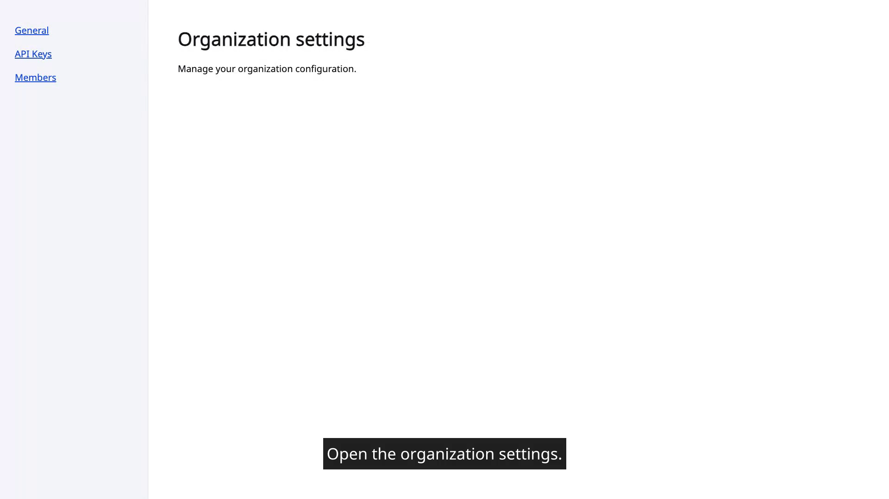
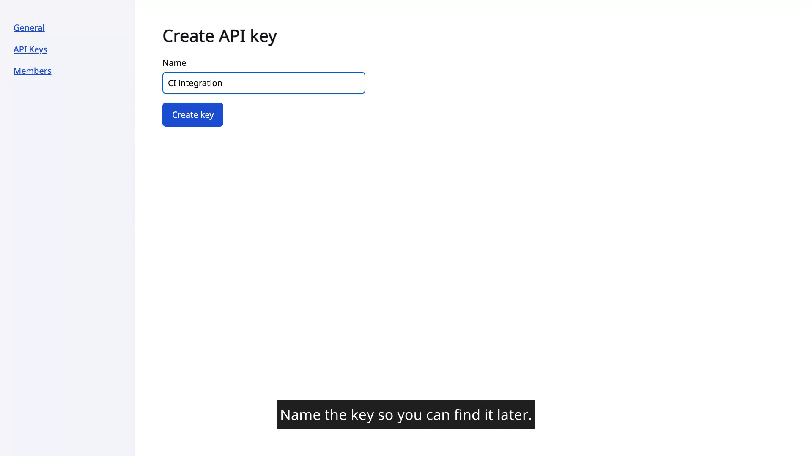
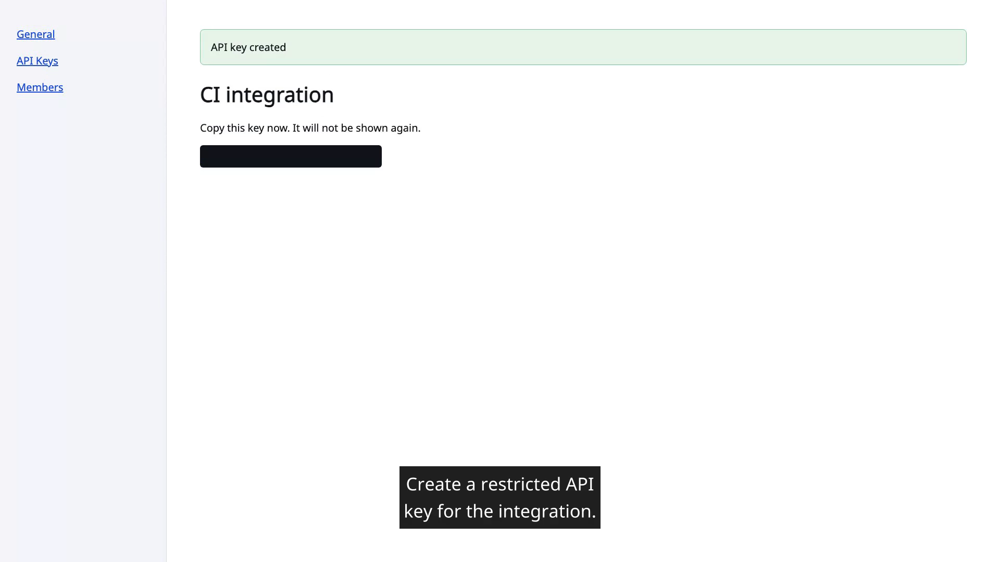
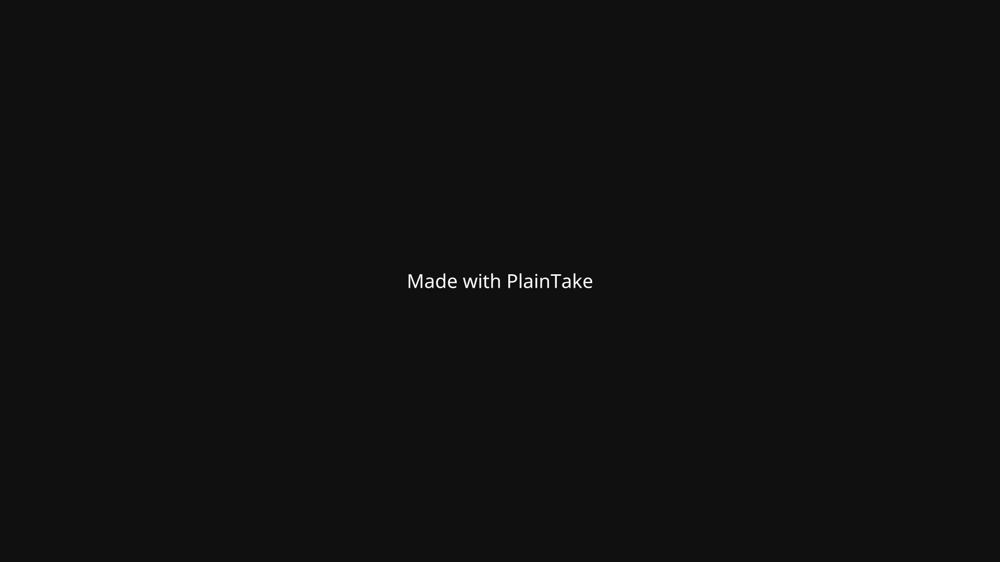

# PlainTake — demo videos you can re-run

> Turns a committed TypeScript file into a narrated browser demo video — locally, with no
> network at render time and nothing to sign up for.

You write the demo as code. PlainTake drives a real Chromium through it, times the
narration, renders the captions, and hands you the video plus everything needed to prove how
it was made. Re-run it after a UI change and you get the same demo again, updated.

**Download:** [latest release](https://github.com/plaintake/plaintake/releases/latest) ·
**Buy a licence:** [plainlab.gumroad.com/l/plaintake](https://plainlab.gumroad.com/l/plaintake)

Each run produces:

- `demo.mp4` — one H.264 video, captions burned into the pixels. A licence can swap the
  burn-in for a selectable caption track instead
- `captions.srt`, `captions.vtt`, `captions.ass` — standalone caption files
- an evidence bundle: the scenario source, the raw capture, a Playwright trace, the semantic
  event timeline, the exact render plan, the toolchain versions, and a SHA-256 manifest you
  can re-verify at any time

**The output is silent by default, and the captions are burned in.** That is a choice, not a
gap: no browser renders an in-container caption track, and neither do Slack, X, LinkedIn or
GitHub, so a selectable track would leave the words invisible in exactly the places demo videos
get shared — and most of them are watched muted. The `.srt` and `.vtt` files are written on every
run, for a `<track>` tag or a translation source.

**A licence can also make the video talk.** `--speech on` reads every caption aloud with a voice
model that runs on your own machine — no network, no account, no API key — and holds each step
open long enough to finish the line. `--speech file` speaks WAVs you supply instead, so a human
voiceover, or a cloud voice you already pay for, gets into the video without PlainTake ever
holding a credential. The captions stay either way: a video that talks is exactly the case where
a muted viewer would otherwise get nothing.

## What it looks like

| | |
|---|---|
|  |  |
|  |  |

Third frame: the API key is masked. Masks are registered by CSS selector *before* the element
exists, so the secret is covered in every frame it could have appeared in — not blurred
afterwards. Fourth frame: the closing card the free tier adds.

The caption file and manifest for those frames are in
[`docs/samples/create-api-key/`](docs/samples/create-api-key/).

---

## Before you install

| Requirement | Notes |
|---|---|
| **FFmpeg, with libass** | Installed separately. Read the next paragraph — this is the one thing that goes wrong. |
| Chromium | Downloaded once by `plaintake install-browser`, about 350 MB |
| Node.js | **Not needed.** The download contains its own. |

### FFmpeg must have libass

Burning captions into the pixels needs an FFmpeg built with libass. **Homebrew's default
`ffmpeg` formula is built without it**, so it has no `ass` or `subtitles` filter and hard
subtitles are impossible. `ffmpeg-full` has it, but it is keg-only — installing it is not
enough, it must also be linked:

```bash
brew uninstall --ignore-dependencies ffmpeg
brew install ffmpeg-full
brew link --force --overwrite ffmpeg-full
```

On Debian and Ubuntu, `apt install ffmpeg` already has libass.

Either way, confirm it before doing anything else:

```bash
plaintake doctor
```

It exits non-zero with install instructions if anything is missing, and tells you which
FFmpeg and libass it found.

---

## Install

Two builds: **macOS arm64** (Apple Silicon) and **Linux x64**. No Windows build, and no macOS
Intel build.

```bash
# 1. Download the tarball for your platform, the checksums, and the installer
VERSION=1.0.0
BASE=https://github.com/plaintake/plaintake/releases/download/v$VERSION
curl -LO $BASE/plaintake-$VERSION-darwin-arm64.tar.gz   # or -linux-x64
curl -LO $BASE/SHA256SUMS
curl -LO $BASE/install.sh

# 2. Check what you downloaded is what was published
shasum -a 256 -c SHA256SUMS --ignore-missing

# 3. Install
sh install.sh plaintake-$VERSION-darwin-arm64.tar.gz
```

That installs to `~/.local/share/plaintake` and symlinks `plaintake` into
`~/.local/bin`. Override either with `PLAINTAKE_PREFIX` and `PLAINTAKE_BINDIR`. If
`~/.local/bin` is not on your `PATH`, the installer says so.

Then, once:

```bash
plaintake install-browser     # downloads Chromium
plaintake doctor              # checks FFmpeg
plaintake                     # the menu
```

**Without the installer.** The tarball is a self-contained tree and the binary finds its own
resources, so this works too:

```bash
tar -xzf plaintake-$VERSION-darwin-arm64.tar.gz
./plaintake-$VERSION-darwin-arm64/bin/plaintake doctor
```

**Upgrading** is the same three steps. The installer replaces the whole tree rather than
merging into it — a half-upgraded install with a new binary and an old vendored Playwright is
worse than no install. Your settings and licence live in `~/.config/plaintake` and are not
touched.

**Uninstalling** is `rm -rf ~/.local/share/plaintake ~/.local/bin/plaintake`, and
`rm -rf ~/.config/plaintake` if you also want the settings and licence gone.

### Why FFmpeg and Chromium are not included

- **FFmpeg**, because the builds this needs are GPL (via libx264), and keeping it a separate
  executable is what keeps those terms off PlainTake and therefore off what you make with
  it. See [`NOTICE.md`](NOTICE.md).
- **Chromium**, because it is ~350 MB with its own licence set, and Playwright's cache is
  shared with any other Playwright install you already have.

---

## The menu

`plaintake` with no arguments opens a terminal menu: record a demo, browse recordings,
settings, licence, toolchain check.

**Recordings** lists every recording under the current directory and, for the one you pick,
offers: play the video, open the folder, show the details, verify the hashes, re-render, or
delete. Deleting asks first and names the size, and refuses anything that is not a recording.

It only starts on a real terminal. Piped, or given a command, you get usage and a non-zero
exit — so an agent running `plaintake` never sits waiting on a prompt.

## Commands

```
plaintake validate <scenario.ts>
plaintake run      <scenario.ts> --output <dir> (--base-url <url> | --fixture)
                                  [--subtitles hard|soft] [--cursor on|off]
                                  [--camera off|zoom]
plaintake render   <bundleDir> [--subtitles hard|soft]
plaintake verify   <bundleDir>
plaintake inspect  <bundleDir>
plaintake doctor
plaintake install-browser
plaintake --version
```

| Command | What it does |
|---|---|
| `validate` | Loads a scenario and checks it, without opening a browser |
| `run` | Records, times the captions, renders, hashes, and writes a recording |
| `render` | Re-renders from a recording's frozen plan. No browser, no network, no clock |
| `verify` | Re-hashes every file against the manifest |
| `inspect` | Reports the video, captions, chapters, output sizes and toolchain. Read-only |
| `doctor` | Checks FFmpeg, libass, x264 and the filters that are needed |

`run` needs exactly one target: `--base-url http://localhost:3000` for your own app, or
`--fixture` for the bundled demo app the shipped examples record against.

`--cursor on` draws a pointer that glides between the scenario's targets and ripples on
clicks; `off`, the default, records none. It is drawn when the video is rendered, from the
recording's frozen plan, so two renders of the same recording stay byte-identical.

`--camera zoom` (Pro) eases the frame in on whatever each step already targets, so the button
being clicked fills the screen instead of sitting in a corner of a full-page shot. The path is
computed from the recorded steps — the same ones the captions and chapters come from — and
frozen into the plan alongside them, so it is as repeatable as everything else here and no
model chose it. `off`, the default, films the raw viewport. Captions and the closing card
never zoom either way.

Add `--json` to any command for a machine-readable result on stdout. Diagnostics always go to
stderr, and the two are never mixed.

| Exit | Meaning |
|---:|---|
| 0 | Success |
| 1 | Scenario or assertion failed |
| 2 | Invalid arguments |
| 3 | Missing toolchain dependency |
| 4 | Capture failure |
| 5 | Render failure |
| 6 | Verification or hash failure |

## Writing a demo

```ts
import { defineDemo } from '@plaintake/scenario';

export default defineDemo({
  schema: 'agent-demo.scenario/v1',
  id: 'create-api-key',
  title: 'Create an API key',
  viewport: { width: 1920, height: 1080, deviceScaleFactor: 1 },
  locale: 'en-US',
  timezoneId: 'UTC',
  colorScheme: 'light',
  reducedMotion: 'reduce',

  async run({ page, demo, baseURL }) {
    // Registered before the secret exists, so it is covered in every frame.
    await demo.mask({ id: 'secret', selector: '[data-testid="api-key-value"]' });

    await demo.chapter('Organization settings');

    await demo.step({
      id: 'open-settings',
      title: 'Open organization settings',
      subtitle: 'Open the organization settings.',
      holdMs: 1500,
      run: () => page.goto(`${baseURL}/settings`, { waitUntil: 'load' }),
    });

    await demo.assert({
      id: 'settings-visible',
      title: 'Settings heading is visible',
      run: () => page.getByRole('heading', { name: 'Organization settings' }).waitFor(),
    });
  },
});
```

Four rules that matter in practice:

- **Set `holdMs`.** Narration is timed at 20 characters per second with a 1.2-second minimum,
  so a step that completes in 40 ms still needs its caption on screen for over a second.
  Without holds you get a frozen frame with captions scrolling over it. The example above went
  from 1.5 seconds of real content under 9 seconds of narration to 8.9 seconds once the holds
  were added.
- **`id` values are yours and stable.** Never generate them.
- **Masks take a CSS selector, not a locator**, which is what lets them be registered before
  the element exists.
- **No `Date.now()`, no `Math.random()`, no external network.** A demo that is not
  deterministic cannot be re-recorded and compared.

`plaintake validate` tells you about all of these before a browser opens.

## Demos of an app behind a login

A one-time code or a CAPTCHA cannot be scripted. So a demo can stop and hand you the real
browser window, and carry on once you are done.

```ts
export default defineDemo({
  // ...
  handoff: 'preflight',        // 'session' if the challenge is part of the demo itself
  handoffTimeoutMs: 120_000,   // the default; 300s is the maximum

  async preflight({ page, demo, baseURL }) {
    await page.goto(`${baseURL}/login`);
    await demo.handoff({
      id: 'sign-in',
      title: 'Sign in, including any 2FA',
      detail: 'The browser window is yours. Come back here when the dashboard is up.',
      until: () => page.waitForURL('**/dashboard', { timeout: 0 }),
    });
  },

  async run({ page, demo, baseURL }) { /* the demo, already signed in */ },
});
```

**Put the sign-in in `preflight`.** It runs before the recording starts, so it is in neither
the video nor the trace. `handoff: 'session'` waits with the camera running, which is right for
a step-up challenge that is genuinely part of the demo and wrong for everything else — the wait
is filmed exactly as it happened, and nothing is cut out afterwards.

**You act in the browser, not in PlainTake.** It never asks for a password, a code, or anything
else secret. There is nowhere for one to go if you tried to give it one: the only thing the
prompt sends back is *done*, *gave up*, or *never mind*. A recording that hands the browser over
also stores **no Playwright trace at all**, because a trace captures every field value —
password fields included — along with request bodies and cookies.

It needs a visible browser window and a terminal, so run it with `plaintake run` or from the
menu. With `--fixture` or in a pipe it is refused straight away, before anything opens — over
MCP it depends on the client, and the next section says which kind works.

There is also `demo.waitFor({ id, title, until })`, which waits for something to happen and
prompts nobody — a push notification you approve on your phone, a link in an email, a background
job finishing. That needs no window and no terminal, so it works anywhere, including CI.

## Use it from an AI agent

PlainTake includes a local MCP server over stdio — four tools, no network, no credentials,
no account.

**Claude Code**, in your project's `.mcp.json`:

```json
{
  "mcpServers": {
    "plaintake": {
      "command": "plaintake",
      "args": ["mcp", "--workspace", "/abs/path/to/your/project"]
    }
  }
}
```

**Codex**, in `~/.codex/config.toml`:

```toml
[mcp_servers.plaintake]
command = "plaintake"
args = ["mcp", "--workspace", "/abs/path/to/your/project"]
```

`--workspace` is a sandbox root: every path a tool accepts must resolve beneath it, and
traversal, absolute paths outside it and symlink escapes are all refused.

It is optional: omitted, the root is the server's cwd — the directory the client launched
from, which in Claude Code is your project — so a config shared across projects can omit it
and follow the client. Pass it when the client may spawn the server from somewhere
unrelated, or to pin the root explicitly. It constrains file paths only; the recorded app
is chosen per call by `demo_run`'s `baseURL` or `fixture`.

⚠️ **Scenario files are executed as code** by `validate` and `run`. The sandbox constrains
which paths the tools accept, not what a loaded scenario may do. Treat a scenario file exactly
as you would treat a test file in the same repository, and do not point the tools at a
directory whose contents you would not run.

A demo that declares `handoff` **needs a visible browser window and a terminal** — and whether
an agent can run one depends on its client. The server is local, so the window opens on your
screen either way. A client that supports elicitation relays the question into the chat: it
tells you the window is open, you do the sign-in or the CAPTCHA in the browser, and you answer
*done* in the chat when you are. The question carries a single checkbox and nothing else, so
there is still nowhere to type a secret — the agent can validate, run, render and verify the
whole recording. A client without elicitation is refused immediately, with nothing launched,
and starting the recording is yours: run `plaintake run` in a terminal. The tool description
says which case you are in.

## What a recording contains

```text
artifacts/create-api-key/
├── scenario/scenario.ts        the exact source that ran
├── raw/session.webm            the raw capture
├── trace/trace.zip             a Playwright trace you can open
├── events/events.ndjson        what happened, and when
├── captions/captions.{srt,vtt,ass}
├── render/render-plan.json     the frozen plan, including the FFmpeg arguments used
├── output/demo.mp4             the one video, in the mode you asked for
├── logs/                       one log per FFmpeg run
├── manifest.json               a SHA-256 of every file
└── manifest.sha256             a hash of the manifest itself
```

Because the plan is frozen, `plaintake render` on an old recording needs no browser, no
network and no clock — and produces the same bytes it did the first time, on the same machine
and FFmpeg build. `plaintake verify` re-checks every hash, including the manifest's own.

Nothing is deleted automatically. Recordings accumulate until you remove them, and the
Recordings panel in the menu is how you do that.

---

## Free and Pro

| | Free | Pro |
|---|---|---|
| Every recording, rendering and MCP feature | ✅ | ✅ |
| Closing credit card | 3s *Made with PlainTake* | removed |
| Your own outro text and colours | ❌ | ✅ |
| MP4 chapter markers from `demo.chapter()` | ❌ | ✅ |
| Selectable caption track instead of burned-in | ❌ | ✅ |
| Camera that zooms toward each step's target | ❌ | ✅ |
| Spoken narration — a local voice model, or your own audio | ❌ | ✅ |
| Price | free | one-time, perpetual |

**Buy a licence: [plainlab.gumroad.com/l/plaintake](https://plainlab.gumroad.com/l/plaintake)** —
the current price is on that page.

Then `plaintake` → *Licence* → *Enter a licence key*. That makes one request to Gumroad and
caches the answer; nothing afterwards touches the network. One payment, no subscription, and
install it on as many of your own machines as you need.

**Chapter events are recorded on every tier.** Only the markers in the MP4 are withheld, so
nothing is lost by recording on Free and activating later — re-render and the chapters appear.

**The camera and the narration are the two things that do not work that way,** and it is better
said here than found out later: the shot list and the audio are worked out and frozen while the
recording is made, so a recording made on Free has neither, and re-rendering it cannot add
either. If you want the zoom or the voice on a demo you already recorded, record it again.

`--speech file` needs a licence too, even though the audio is your own and nothing is
synthesised: what a licence unlocks is the narration track in the video, not the voice model.

**The caption files are written on every tier** too. `captions.srt` and `captions.vtt` sit
beside the video whatever you paid, so a `<track>` tag or a translation source needs no
licence. What a licence buys is the track muxed *into* the MP4, for the desktop players that
render one.

**The videos are yours on both tiers.** No ownership claim, no licence back to us, no
restriction on selling what you make. See [`LICENSE`](LICENSE) §3.

## What it does not do

Stated up front rather than discovered later:

- **The only sound is the captions read aloud** — no microphone, no page audio, no system
  audio, no music, no sound effects. `--speech` needs a licence and a one-time 93 MB voice-model
  download. There are 28 English voices and no per-voice tuning, no speed control and no
  per-step override; the pronunciation dictionary is US English only, so a non-English scenario
  gets captions and no voice rather than an accent reading the wrong sounds. A video that talks
  is longer than the same demo recorded silent, because each step waits for its line to finish.
- **macOS arm64 and Linux x64 only.** No Windows build. No macOS Intel build.
- **Chromium only**, one tab, one page.
- **Fixed 1920×1080 at 30 fps.** No other resolutions or aspect ratios.
- **The cursor is optional and synthetic.** `--cursor on` draws one pointer shape with click
  ripples, generated from the scenario's targets — it is not your real mouse, there are no
  styles to configure, and `off` (the default) films none.
- **The camera zooms, and that is all it does.** `--camera zoom` crops toward the rect a step
  already targets and eases between shots. It never decides *what* is interesting — no
  saliency, no model, no scene detection — so a step with no target moves nothing. The zoom is
  upscaled from the same 1920×1080 capture, so it is capped at 1.6× before the text turns to
  mush, and it costs render time. `off` is the default and films the raw viewport.
- **Captions are written by you**, never transcribed.
- **Chapter markers come only from `demo.chapter()`** — never invented from step titles.
- **A `session` handoff is filmed.** No pause, no resume, nothing cut out — so a code the page
  shows in the clear while you work is in the finished video. `preflight` is the mode that
  avoids that, and `demo.mask()` covers a field you name and nothing else, not a toast and not
  the URL bar. A demo recorded this way is also not reproducible: your own timing is an input to
  it, though re-rendering the recording afterwards is as reproducible as any other.
- **A handoff opens a visible browser**, which draws text on slightly different pixels than the
  headless one and asks for `/favicon.ico`. An app without a favicon logs a 404 that fails the
  run; the recorder log explains it, and `allowedConsoleErrors` is where you silence it.
- **Nothing prunes old recordings.** Deleting is a deliberate act.
- The licence check runs on your own machine in a binary you hold, so it is
  tamper-*evident*, not tamper-proof. It is a receipt, not a lock, and a licensing failure
  never blocks a recording — it falls back to the free tier and says why.

## Support

- **Something is broken:** [open an issue](https://github.com/plaintake/plaintake/issues/new/choose).
  Please include the output of `plaintake doctor --json`, which names your version, FFmpeg
  and libass.
- **Purchases, keys and refunds:** through
  [Gumroad](https://plainlab.gumroad.com/l/plaintake), which handles payment.

This repository is the download and issue channel.

---

PlainTake is proprietary software; see [`LICENSE`](LICENSE) for the terms and
[`NOTICE.md`](NOTICE.md) for the third-party components it uses. Noto Sans is bundled under the
SIL Open Font License 1.1 and Playwright is redistributed under Apache-2.0. FFmpeg is a
separately installed external executable and is deliberately not redistributed.

&copy; 2026 PlainLab
